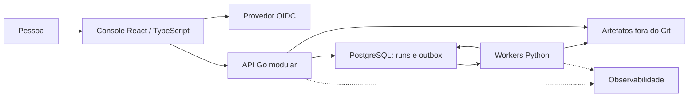

# Arquitetura planejada

**Estado: pendente de implementação.** O desenho abaixo representa a direção do projeto, sem comprovar serviços em execução.

O primeiro ambiente será local, com API, worker CPU, PostgreSQL e IdP no Compose. Na evolução de eventos, estudar Kafka local e compará-lo a Pub/Sub na referência GCP. BigQuery será uma camada analítica posterior.

A trilha também prevê um experimento inicial de API Python e comando/worker Go para estudar processos e HTTP, antes da organização final com API Go e workers Python.

## Fronteiras

- Console apresenta estado e resultados reais e não recebe segredos de provedores.
- API aceita runs persistidos e autoriza tenant e objeto no servidor.
- Worker executa tarefas com limites, idempotência e recuperação.
- Treinamento é um job operacional separado da inferência exposta no console.
- Datasets, modelos e relatórios pertencem a experimentos identificados e versionados.

## Evolução — pendente

- [ ] Desenhar C1, C2, C3 e deployment com decisões justificadas.
- [ ] Implementar a primeira execução local de ponta a ponta.
- [ ] Exercitar outbox, inbox, retries, leases, DLQ e replay.
- [ ] Preparar demo econômica em Cloud Run, com limites e desligamento.
- [ ] Comparar GKE, GPU e alta disponibilidade em ambientes temporários.
- [ ] Rever a extração de serviços quando isolamento ou escala a justificarem.
